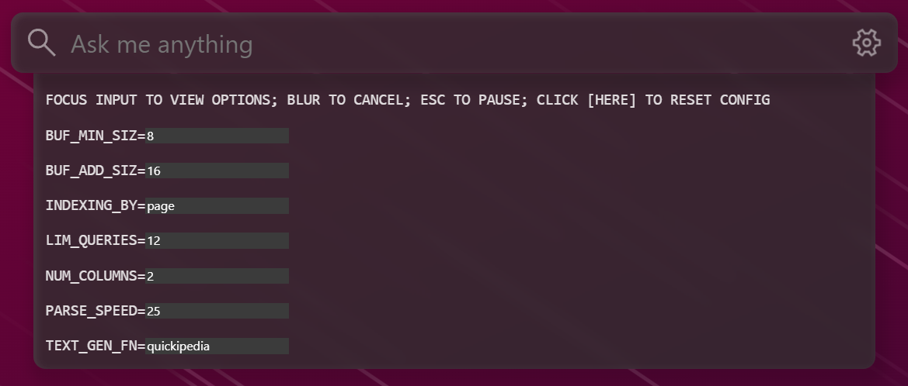

## Notes for running in Docker

Defaults for swap space and disk space may be too small.

If using docker desktop on MacOS suggest setting swap to 4 GB and virtual disk limit to at least around 100 GB.  

These numbers have not been carefully tested.


## Disclaimer

There may some delay between what you see being parsed due to the speed of the embedding service,
especially if you're using a lower-end computer. You can try switching out the model with a faster one.
 - `https://huggingface.co/intfloat/e5-small-v2` is quite good and would be simple to plug into the
   current embedding microservice. It runs ~2x faster than the default `e5-base-v2` used
 - More info on the embedding service further down.

If you're using the GPU (CUDA), you may experience the first few embedding taking up to 5-6 seconds, but after that
it's much faster than the CPU equivalent. 

## The Frontend


The frontend contains four main parts:

- The "columns" on the right, which display the texts as they're parsed and fed to the
  backend to be embedded and indexed
- The search bar, where you can query anything, and it'll return the closest matching sentences/
  extracts (depending on your settings)
- The cards, which display the resulting matches
  - You can see at a glance how similar it is by the tagged colors
    - The default model generates similarities clustered around ~.6-.8, so the color is rescaled
      to better represent the true similarity
  - Hover over any card to view its cosine similarity to the query
  - Click on any card to go to the original article to see more about the subject

## Usage

- `pip install -r server/embedding-microservice/requirements.txt`
- `npm install --prefix client`
- set the following environment variables:
  - `export ASTRA_DEMO_DB_ID=...`
  - `export ASTRA_DEMO_TOKEN=...`
  - `export ASTRA_DEMO_KEYSPACE=...`

To run everything separately, you can do (each from the root dir):
- `cd ./client; npx vite`
- `python ./server/embedding-microservice/microservice.py`
- `cd ./server; ./gradlew bootRun`

or alternatively, just run the `run.sh` file @ the root of the directory (`chmod +x run.sh` if necessary).

You can also do `./run.sh open` to allow Vite and Spring to be accessed from other devices on the network,
using the host's ip address.

The default port for Vite should be `5173`, and `8081` for Spring.

## Optional environment variables:

- `export ASTRA_DEMO_EMBEDDING_SERVICE_PORT=...`
  - Sets the port for the default embedding microservice
  - Default: `5000`
- `export ASTRA_DEMO_EMBEDDING_SERVICE_URL=...`
  - Sets the URL for the embedding microservice (must be updated if `port` is changed)
  - Default: `http://localhost:5000/embed`
- `export ASTRA_DEMO_EMBEDDING_SERVICE_MODEL=...`
  - Sets the model to send the embedding microservice
  - Default: `base_v2`
- `export ASTRA_DEMO_EMBEDDING_SERVICE_DIMS=...`
  - Sets the dimensionality of the model
  - Default: `384`
- `export ASTRA_DEMO_EMBEDDING_SERVICE_DEVICE=...`
  - Explicitly sets the device used for embedding
  - Defaults to `"cuda" if torch.cuda.is_available() else "cpu"` if not set
- `export ASTRA_DEMO_ENTITY_TTL=...`
  - Sets the TTL for every text entity inserted into the db. Use a negative number for no TTL
  - Default: `86400 (24 hrs)`
- `export ASTRA_DEMO_SHARE_TEXTS=...`
  - Sets whether all connections should use the same shared set of texts, or if they use only what they scraped themselves
  - Default: `false`
- `export VITE_BACKEND_URL=...`
  - Sets the URL of the Spring backend
  - Default: `http://localhost:8081/`

## Custom embedding

The default microservice can be found in the `server/embedding-microservice` directory.

It is here that you can add your own custom models if you so desire, or you can even create
a whole new custom one; just be sure to update the appropriate env variables.

The request DTO is like so:

```java
record EmbedRequest(List<String> texts, String model)
```

and the service must return a `List<List<Double>>` in return.

If you change the dimensions of the embedding, you'll have to manually drop your indexing table from the CQL
console for it to create the new table with the differing dimensionality.

```cql
DROP TABLE [keyspace].indexing;
```

## Client-side options



Clicking on the settings icon will get you these settings. You can click on any text box to
quickly find its valid values.

- `BUF_MIN_SIZ:` The minimum size of the text buffer before the client generates/requests more text.
- `BUF_ADD_SIZ:` How many new pieces of texts the generator provides the buffer
  - In other words, when the number of extracts left in the buffer falls under `BUF_MIN_SIZE`,
    it requests `BUF_ADD_SIZ` more extracts from the API
- `INDEXING_BY:` Determines if each page/extract is split up into sentences or fed to the database directly.
  - Using `sentence` may yield worse results, especially because sentences may be wrongly split up due to
    acronyms and such.
- `LIM_QUERIES:` The number of search results returned from the server
- `NUM_COLUMNS:` The number of columns parsing and feeding text to the server
- `PARSE_SPEED:` How fast a column burns through pieces of text (in ms per printed unit)
- `TEXT_GEN_FN:` The generation strategy for generating the text
  - `wikipedia:` Fetches extracts from wikipedia to parse, displays it word by word
  - `quickipedia:` Fetches extracts from wikipedia to parse, displays it extract by extract (much faster, less feedback)
  - `lorem:` Generates lorem-ipsum-like text

## Basic troubleshooting

Always try refreshing the page first (The site doesn't auto-reconnect to the server).

If you *consistently* run into an issue on the client-side with unexpectedly disconnecting from the server, and there's
an error in the console (in the CloseRequest) about the buffer being too large or something, do
`export VITE_CHARS_PER_CHUNK=...` with a smaller number (-500) each time until it works (it starts @ 8500)

There's also a small chance you might get rate-limited by the wikipedia API, but I highly doubt you'll run into that.

# Etc.

This hasn't been tested with multiple connections, but it should theoretically work if multiple people were to
connect to the same backend.
